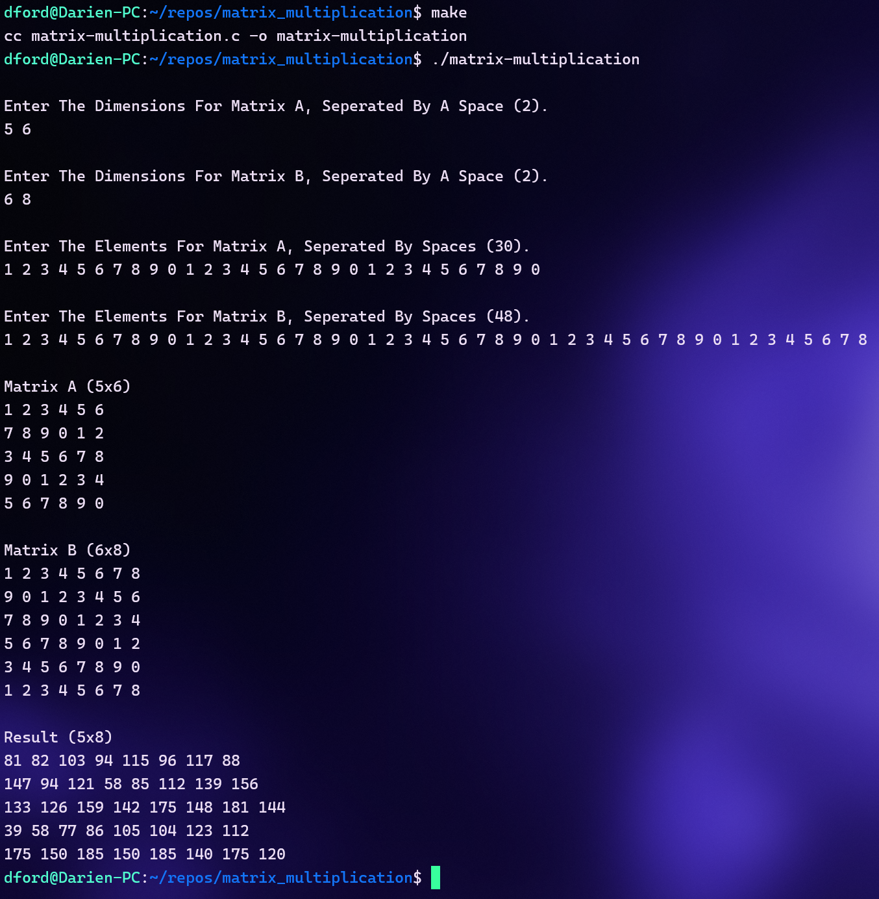

# Concurrent Matrix Multiplication Program

## Introduction
This is a public repository for my concurrent matrix multiplication program written in C, which uses fork and pipe to calculate the resultant matrix from multiplying the two input matrices.

## How It Works
  - Take in the elements of Matrix A and Matrix B from stdin
  - Print Matrix A and Matrix B to stdout
  - Create child processes using the fork system call
  - Create pipes for process communication using the pipe system call
  - Send the row and column elements to the first row and column child processes
  - Each child process multiplies the row and column elements it currently has, adds the product to its sum, and passes the elements down the row and column respectively, to the next child process
  - After a child process finishes all calculations, its sum is written to a pipe
  - The main program reads the sums of all child processes
  - Print the resulting matrix to stdout

## Usage
  - Clone this repository
  - Navigate to `/matrix_multiplication`
  - Run the `make` command
  - Run `./matrix_multiplication`
  - Enter the dimensions for Matrix A separated by spaces
  - Enter the dimensions for Matrix B separated by spaces
